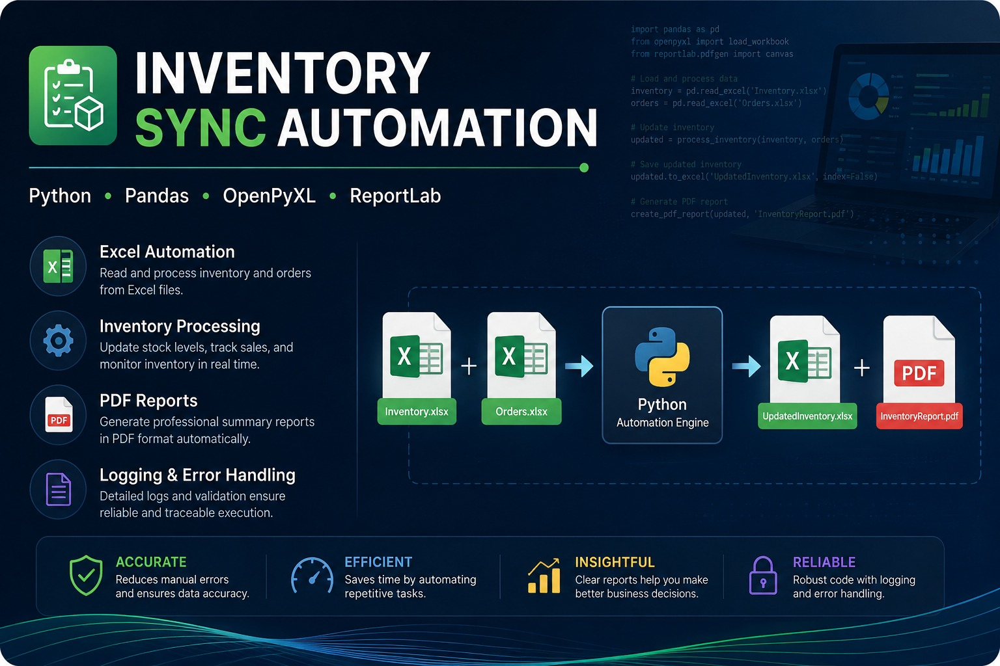
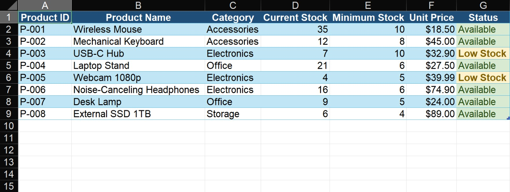
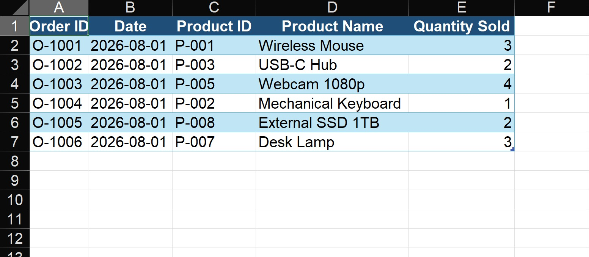
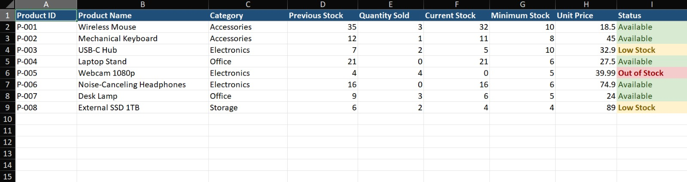
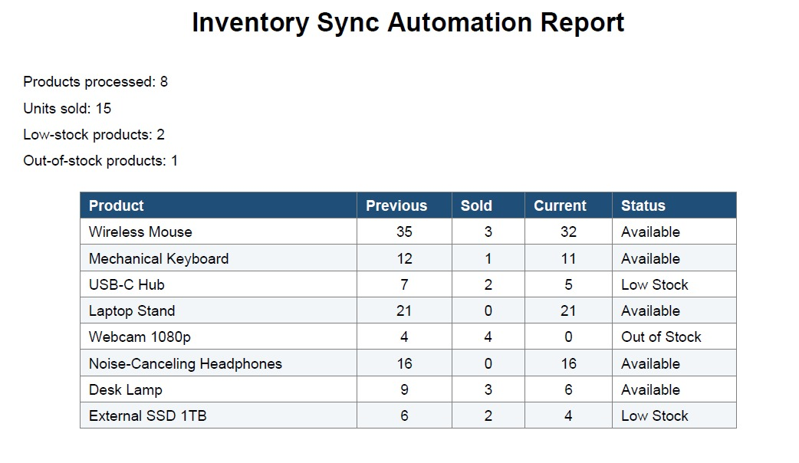
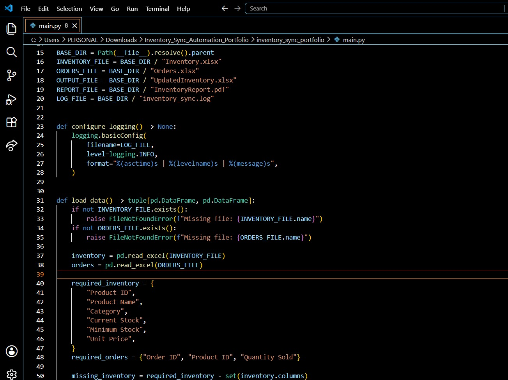
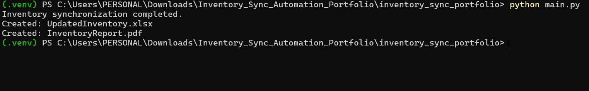

# Inventory Sync Automation




## Overview

Inventory Sync Automation is a Python application that automates inventory management using Excel workbooks.

The system processes customer orders, updates inventory levels automatically, detects products with low stock, generates a new Excel inventory file, creates a professional PDF report, and logs the execution for traceability.

---

## Features

- Read inventory data from Excel
- Process customer orders automatically
- Update stock quantities
- Detect low inventory products
- Generate an updated Excel workbook
- Generate a PDF summary report
- Execution logging
- Input file validation
- Error handling

---

## Tech Stack

- Python 3
- Pandas
- OpenPyXL
- ReportLab

---

## Screenshots

### 📥 Original Inventory

The original inventory before processing customer orders.



---

### 🛒 Orders Input

Customer orders that will be processed by the automation.



---

### 📦 Updated Inventory

Automatically updated inventory after processing all orders.



---

### 📄 Generated PDF Report

Automatically generated inventory summary report.



---

### 💻 Python Source Code

Core business logic responsible for inventory synchronization.



---

### ✅ Successful Execution

Program execution showing the generated files.



---

## Project Structure

```text
inventory_sync_portfolio/
│
├── images/
│   ├── inventory_original.png
│   ├── orders_input.png
│   ├── updated_inventory.png
│   ├── inventory_report.png
│   ├── code.png
│   └── terminal.png
│
├── Inventory.xlsx
├── Orders.xlsx
├── UpdatedInventory.xlsx
├── InventoryReport.pdf
├── inventory_sync.log
├── main.py
├── requirements.txt
└── README.md
```

---

## Workflow

```text
Inventory.xlsx
        │
        ▼
Orders.xlsx
        │
        ▼
Python Automation
        │
        ▼
UpdatedInventory.xlsx
        │
        ▼
InventoryReport.pdf
```

---

## Installation

Clone the repository:

```bash
git clone https://github.com/jjortiz-lpd/inventory-sync-automation.git
```

Install dependencies:

```bash
pip install -r requirements.txt
```

Run the application:

```bash
python main.py
```

---

## Output

After execution, the application generates:

- ✅ UpdatedInventory.xlsx
- ✅ InventoryReport.pdf
- ✅ inventory_sync.log

---

## Future Improvements

- SQL Database Integration
- REST API
- Google Sheets Integration
- Email Notifications
- Interactive Dashboard
- Scheduled Synchronization

---

## Author

**Juan Ortiz**

Python Automation • Excel Automation • Data Processing • Business Automation